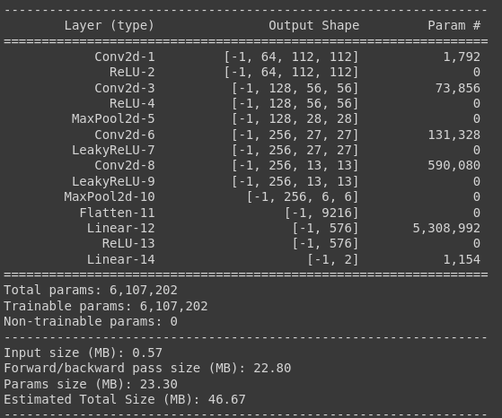

# Cat & Dog classifier

[Dataset Used](https://s3.amazonaws.com/content.udacity-data.com/nd089/Cat_Dog_data.zip)

> link to [model](Cat_Dog_Model)

> link to [python notebook](Cats_vs_Dogs.ipynb)

### Model Structure

### Accuracies

- Average Training accuracy = 74.52%
- Average Testing accuracy = 84.06%
